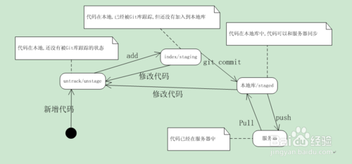
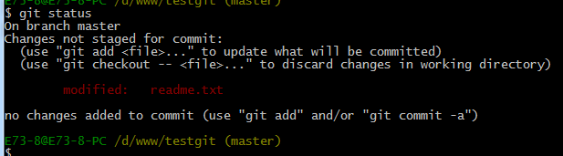
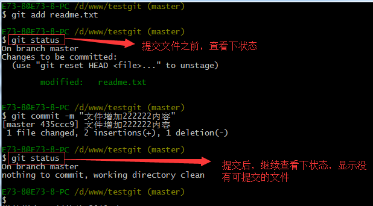
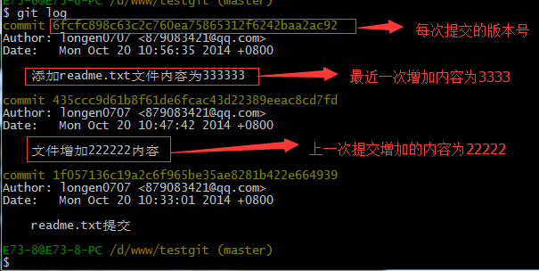
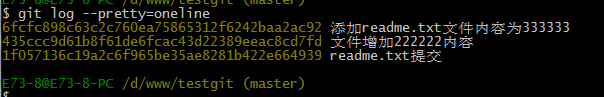

#git使用说明
###一.git是什么
git是一个快速，可扩展的分布式版本控制系统，它具有极为丰富的命令集，对内部系统提高了高级操作和完全访问。所谓版本控制系统，从狭义上来说，它是软件项目开发过程中用于存储我们所写的代码所有修订版本的软件，但事实上我们。。。。。。
###二.git代码状态转换图

###三.git的个人本地使用及其操作
####（1）创建版本库
**`什么是版本库？版本库又名仓库，英文名repository，你可以简单的理解成一个目录，该目录下的所有文件都可以被Git管理起来，每个文件的删除以及修改，Git都能跟踪，以便任何时刻都可以追踪历史，或者在某个时刻将其还原。`**
*创建一个版本库非常简单，例如我需要在D盘的www文件下面创建一个名字叫做testgit的版本库。*
*<span>首先创建一个文件夹:</span>*
```
$ cd D:
$ cd www
$ mkdir testgit
$ cd testgit 
```

*<span>其次通过git init 命令把这个目录变成git可以管理的仓库，如下：</span>*
```
$ git init
```

这个时候你的的testgit文件下会多出一个.git的目录，其是Git来跟踪管理版本库的，**`没事不要改修该文件下的任何文件,否则会破坏掉git仓库`**,如下图所示：

<span>把文件添加到版本库中</span>
<p>首先要明确下，所有的版本控制系统，只能跟踪文本文件的改动，比如txt文件，网页，所有程序的代码等，Git也不列外，版本控制系统可以告诉你每次的改动，但是图片，视频这些二进制文件，虽能也能由版本控制系统管理，但没法跟踪文件的变化，只能把二进制文件每次改动串起来，也就是知道图片从1kb变成2kb，但是到底改了啥，版本控制也不知道。</p>
####下面先看下demo如下演示：
我在版本库testgit目录下新建一个记事本文件 readme.txt 内容如下：11111111
`第一步：使用命令 git add readme.txt添加到暂存区里面去。如下：`

如果没有任何提示则说明添加成功
`第二步：用命令`
>git commit

`告诉Git，把文件提交到仓库。`

`现在我们已经提交了一个readme.txt文件了，我们下面可以通过命令`
>git status

`来查看是否还有文件未提交，如下：`

说明没有任何文件未提交，但是我现在继续来改下readme.txt内容，比如我在下面添加一行2222222222内容，继续使用git status来查看下结果，如下：
如上可以看到，readme.txt文件内容从一行11111111改成 二行 添加了一行22222222内容。
知道了对readme.txt文件做了什么修改后，我们可以放心的提交到仓库了，提交修改和提交文件是一样的2步(第一步是git add  第二步是：git commit)。
如下：

>##版本回退

<p>如果我们想查看下历史记录，可以使用</p>
>git log

演示如下所示

<span>如果嫌上面显示的信息太多的话，我们可以使用命令 git log –pretty=oneline 演示如下：</span>

<p>如果想退回到上一个版本，命令如下</p>
>git reset --hard HEAD^

查看文档内容：
>cat 文档名

>##理解工作区与暂存区的区别

**工作区：**就是你在电脑上看到的目录，比如目录下testgit里的文件(.git隐藏目录版本库除外)。或者以后需要再新建的目录文件等等都属于工作区范畴。
**版本库(Repository):**工作区有一个隐藏目录.git,这个不属于工作区，这是版本库。其中版本库里面存了很多东西，其中最重要的就是stage(暂存区)，还有Git为我们自动创建了第一个分支master,以及指向master的一个指针HEAD。


